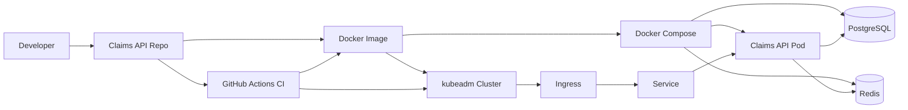

# Workshop Architecture Diagram

Use this diagram during the workshop to explain how the same backend moves through local development, container packaging, Kubernetes deployment, and CI validation.

## How To Explain It

- The developer writes code in the claims API repo.
- Docker turns that code into a portable image.
- Docker Compose is the local learning step for running the app with Postgres and Redis.
- kubeadm is the Kubernetes learning step for running the same app with cluster primitives like Deployment, Service, and Ingress.
- GitHub Actions validates code, container build, and Kubernetes configuration before delivery.

## Workshop Talking Points

- Docker solves packaging and environment consistency.
- Compose solves local multi-service startup pain.
- Kubernetes solves orchestration, service discovery, rollout, and scaling problems.
- CI catches obvious delivery failures before a human tries to deploy.
